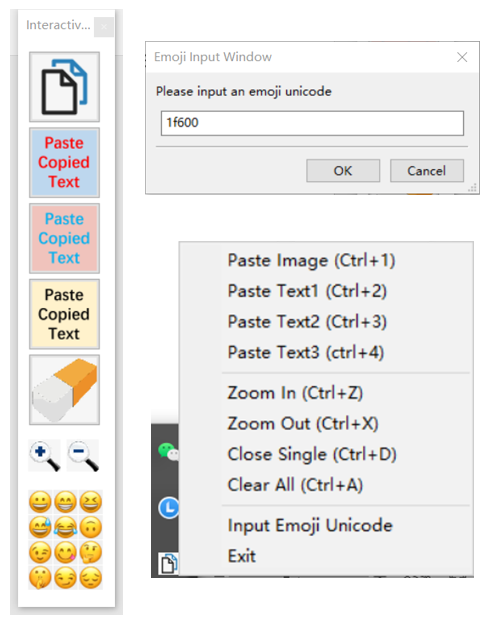

# Interactive Sticker
This is a toolbox for improving online teaching by copying and pasting images, texts and emoji. You can also drag them to anywhere in your desktop, zoom in and out, close single one and clear them all. Besides, you can customize your emoji by inputing the unicode. 



# Setup
```shell
pip install wxpython
```

# Emoji Images Download
Download emoji images from https://emojipedia.org/ and put them under ./amoji_apple/

# Distribution
```shell
pip install pyinstaller
pyinstaller -w -F interactive_sticker.py
```
